# 🎧 Digital Filtering of an Audio Signal

## 🌍 Overview

This project focuses on **digital FIR filtering of an audio signal** using `MATLAB`.  
It consists of two main parts:

- **Part 1:** Development of a filter design tool supporting:
  - Windowed Sinc FIR design
  - Least Squares (LS) FIR design
  - Weighted Least Squares (WLS) FIR design
- **Part 2:** Practical application of the tool to:
  - Analyze an audio file in time and frequency domains
  - Add a sinusoidal interference
  - Design FIR filters to suppress the interference
  - Evaluate the results by plotting spectra and listening to the processed audio

## ✨ Features

- **Interactive FIR filter design tool (Part 1):**
  - Windowed Sinc design with selectable window type:
    - Rectangular, Blackman, Chebyshev, and Kaiser windows
  - Least Squares (LS) FIR design
  - Weighted Least Squares (WLS) FIR design with separate weights for passband, transition band, and stopband
  - User control over:
    - Filter length (impulse response length)
    - Number of points in the desired frequency response (for LS/WLS)
  - Magnitude response plots in both **linear** and **log (dB)** scale

- **Practical audio filtering pipeline (Part 2):**
  - Read and upsample an audio signal
  - Analyze the frequency spectrum before and after upsampling
  - Add a sinusoidal interference and analyze its effect
  - Design and test different FIR filters
  - Filter the corrupted audio and compare spectra
  - Listen to the audio before and after filtering

## 🧩 Project Parts

---

## 🧱 Part 1 – FIR Filter Design Tool

### 🪟 Windowed Sinc FIR Filter

**Brief Explanation**

The windowed sinc method starts from an ideal (infinite-length) impulse response, often derived from a sinc function (low-pass), and then truncates it with a **window function** to obtain a practical, finite-length FIR filter. Different windows (Rectangular, Blackman, Chebyshev, Kaiser) are used to control the trade-off between main-lobe width and side-lobe level.

**Advantages**

- Simple and intuitive design procedure.
- Always stable (FIR) with exactly linear phase.
- Window choice allows control over:
  - Stopband attenuation
  - Transition bandwidth

**Disadvantages**

- Filter order may need to be large to achieve sharp transitions.
- Control of passband/stopband ripple and exact specifications is indirect.
- Best suited for “classical” responses (LP, HP, BP, BS) rather than arbitrary shapes.

---

### 📉 Least Squares (LS) FIR Filter

**Brief Explanation**

The Least Squares (LS) method designs an FIR filter by minimizing the **integrated squared error** between a desired frequency response and the actual filter response. This is done by solving a linear system derived from sampled frequency-domain constraints.

**Advantages**

- Produces an FIR filter that approximates the desired response in a least-squares sense.
- More flexible than pure window methods for shaping the response.
- Can handle arbitrary desired magnitude responses over different frequency bands.

**Disadvantages**

- Requires solving a matrix equation (more computationally involved than basic windowed sinc).
- Passband and stopband ripples are not directly equalized or controlled like in equiripple designs.
- No built-in prioritization between different bands (all errors are treated equally).

---

### ⚖️ Weighted Least Squares (WLS) FIR Filter

**Brief Explanation**

**Weighted Least Squares (WLS)** extends LS design by introducing **weights** for different frequency regionssuch as passband, transition, and stopband. The error in heavily weighted bands is penalized more, allowing you to emphasize passband fidelity or stopband attenuation as needed.

**Advantages**

- Greater design flexibility via band-dependent weighting.
- Can prioritize:
  - Very low error in passband, or
  - Very strong attenuation in stopband
- Useful for practical designs where some bands are more critical than others.

**Disadvantages**

- More complex than unweighted LS (must choose appropriate weights).
- Still requires solving a weighted matrix equation.
- Poorly chosen weights can lead to unbalanced designs or unnecessarily high filter orders.

---

## 🎶 Part 2 – Practical Audio Filtering

Below is a brief step-by-step description of the practical processing performed in Part 2.

---

### 1) Audio Frequency Spectrum Analysis

- An audio file is read using `audioread`.
- The audio is upsampled by a factor of 2 using `resample`.
- The frequency spectra **before** and **after** upsampling are analyzed and plotted.

**🖼️ Figures (Audio Spectrum Before & After Upsampling)**

| 1)	Frequency Spectrum Before Upsampling | 1)	Frequency Spectrum After Upsampling |
| ----------------------- | ------------------------ |
| 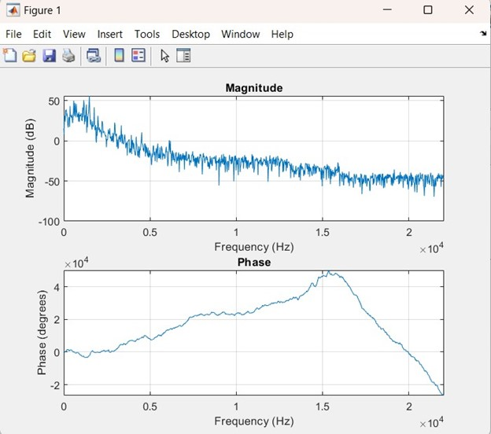 | 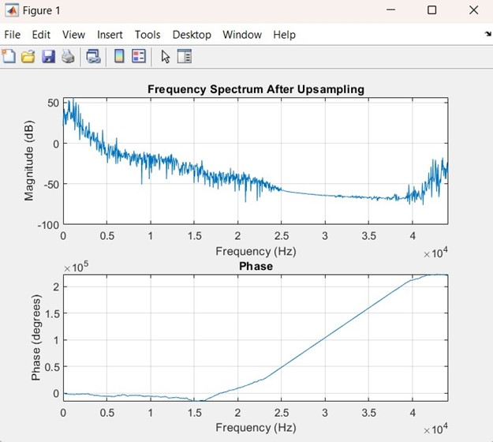 |

---

### 2) Audio + Interference Signal Analysis

- A sinusoidal interference is generated at a frequency that does **not** overlap the useful audio band.
- The interference is added to the upsampled audio.
- Time-domain waveforms and spectra of the corrupted audio are analyzed.

**🖼️ Figures (Audio + Interference)**

| Time Domain of the Audio Signal + Interference  | Frequency Spectrum of the Audio After + Interference |
| ------------------------------------------ | -------------------------------- |
| 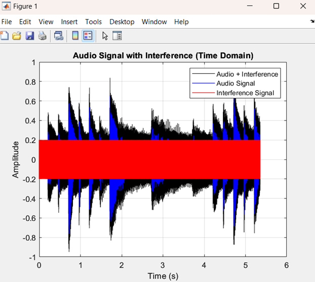 | 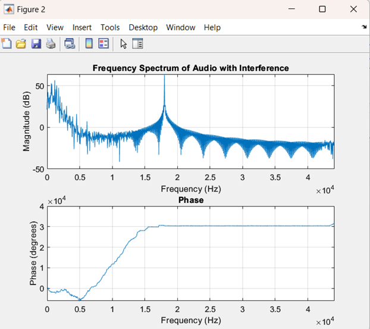 |

---

### 3) Filter Design and Testing

In this step, different FIR filters (Windowed Sinc, LS, WLS) are **designed using the tool from Part 1** and then applied to the corrupted audio to attenuate the interference while preserving the useful audio content.

#### 🪟 3.1 Windowed Sinc FIR Filter

- A windowed sinc FIR filter is designed using one of the supported windows (Rectangular, Blackman, Chebyshev, Kaiser).
- The filter is applied to the audio + interference signal to test its ability to suppress the tonal interference.

**🔍 Filter Frequency Response (Linear and Log Scale)**

| Linear Scale Response | Log Scale (dB) Response |
| --------------------- | ---------------------- |
| 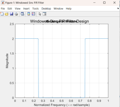 | 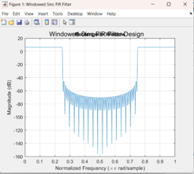 |

**🎧 Frequency Spectrum of Filtered Audio**

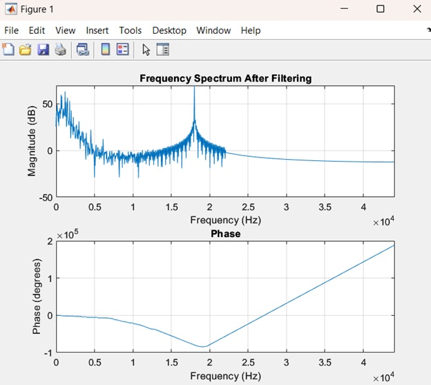

---

#### 📉 3.2 Least Squares (LS) FIR Filter

- An LS FIR filter is designed by specifying a desired magnitude response and number of frequency samples.
- The LS filter is applied to the audio + interference signal for performance evaluation.

**🔍 Filter Frequency Response (Linear and Log Scale)**

| Linear Scale Response | Log Scale (dB) Response |
| --------------------- | ---------------------- |
| 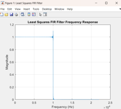 | 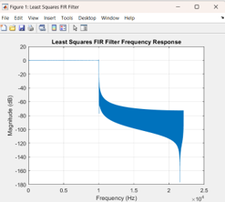 |

**🎧 Frequency Spectrum of Filtered Audio**

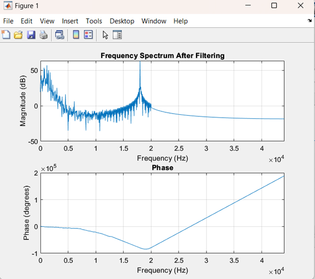

---

#### ⚖️ 3.3 Weighted Least Squares (WLS) FIR Filter

- A WLS FIR filter is designed with different weights assigned to passband, transition band, and stopband.
- The filter is applied to the audio + interference signal to achieve a compromise between interference suppression and audio quality.

**🔍 Filter Frequency Response (Linear and Log Scale)**

| Linear Scale Response | Log Scale (dB) Response |
| --------------------- | ---------------------- |
| 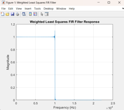 | 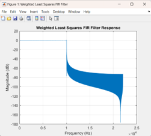 |

**🎧 Frequency Spectrum of Filtered Audio**

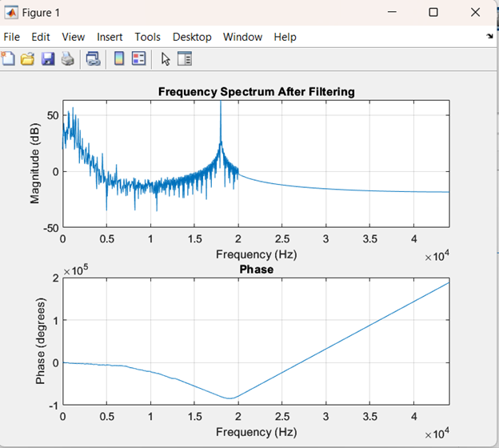

---

## 📄 License

⚠️ **Important Notice:** This repository is publicly available for viewing only. Forking, cloning, or redistributing this project is **NOT** permitted without explicit permission.

Copyright (c) 2025 Chameleon Tech
